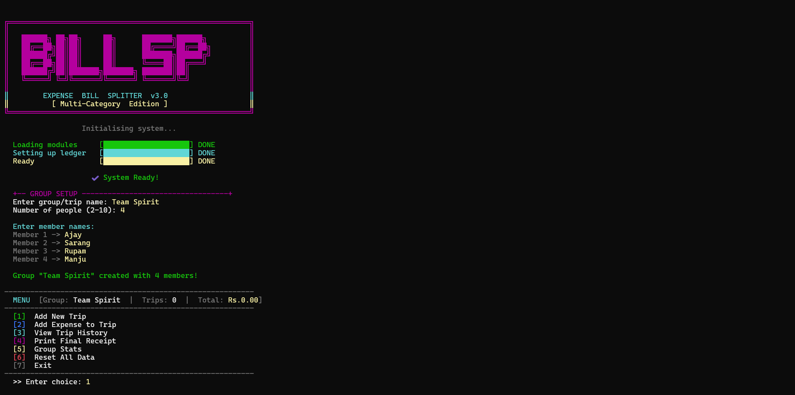
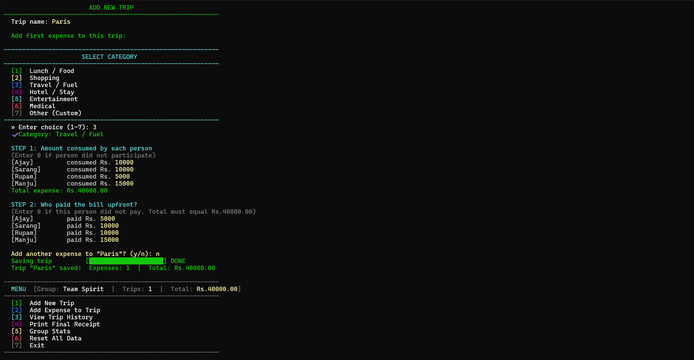
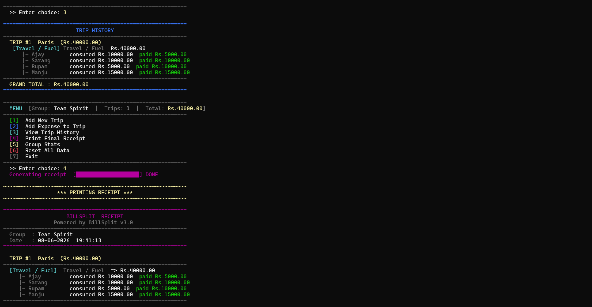
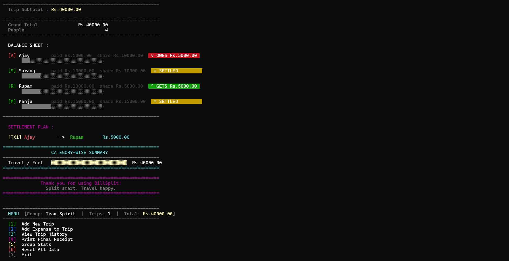
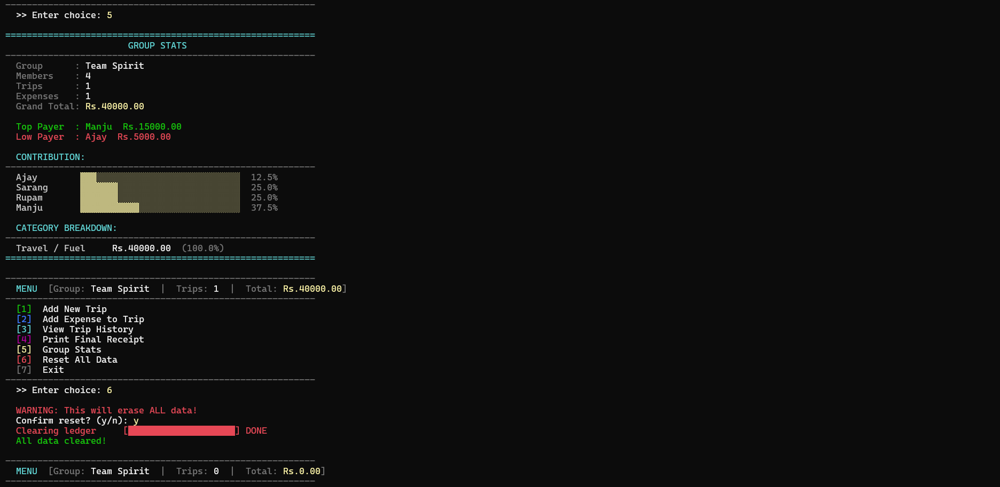

# BillSplit Expense Splitter

A C++ console-based application designed to manage and split group expenses during trips. The project helps users track expenses, calculate individual contributions, generate receipts, and simplify settlement among group members.

## Features

* Multi-trip expense management
* Category-wise expense tracking
* Individual contribution calculation
* Automatic settlement plan generation
* Detailed receipt generation
* Group statistics and reports
* User-friendly colorful console interface

## Technologies Used

* C++
* Standard Template Library (STL)
* Object-Oriented Programming (OOP)

## Screenshots

### Splash Screen



### Main Menu



### Add Expense



### Final Receipt & Settlement



### Group Statistics



## How to Run

Compile:

```bash
g++ Final_mp.cpp -o BillSplit
```

Run:

```bash
./BillSplit
```

## Project Highlights

* Handles multiple trips and expenses efficiently.
* Calculates who owes whom and how much.
* Generates a clear settlement plan.
* Provides category-wise spending analysis.

## Author

Ajay Khot
